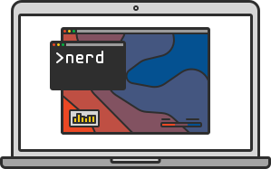

# Nerd - Nerdalize Command Line Interface
Your personal `nerd` that takes care of running compute jobs on the [Nerdalize cloud](https://www.nerdalize.com/).

---



[Nerdalize](https://www.nerdalize.com/) is building a different cloud. Instead of constructing huge datacenters, we're distributing our servers over homes. Homeowners use the residual heat for hot showers and to warm their house, and we don't need to build new infrastructure.

In order to make our cloud resources accessible and easy to use, we've developed a CLI that fits your workflow. Whether you’re a researcher, engineer or developer, it allows you to easily run your computations, simulations and analyses on our cloud infrastructure.

__Features__:
  - Moving __datasets__ from you workstation to the cloud and back is included right into the workflow
  - Nerd ensures efficient and quick datatransfers through a __deduplication__ algorithm
  - Send in __thousands of jobs__, Nerd makes sure your resources are used as efficiently as possible
  - Package your software using industry-standard __Docker__ containers
  - Follows basic CLI conventions to provide a __scriptable__ interface your daily dose of automation goodness

## Documentation
To start running your compute on the Nerdalize cloud you'll need to set up an account and download the Nerd CLI itself.

  - [Quickstarts](https://www.nerdalize.com/docs/) - To quickly get you up and running.
  - [Ready-to-use Software ](https://www.nerdalize.com/applications/) - We have application-specific guides for Python or FFmpeg for you to get started.
  - [CLI Reference](https://www.nerdalize.com/docs/reference/cli/) - For a reference of all available commands

---

## Power users
The Nerd is capable of some powerful scripting and customization options. The rest of this guide is somewhat advanced and is not required for day-to-day use of the Nerdalize cloud.

### Config

The `nerd` command uses a config file located at `~/.nerd/config.json` (location can be changed with the `--config-file` option) which can be used to customize nerd's behaviour.
The structure of the config and the defaults are show below:
```bash
{
        "auth": {
                "api_endpoint": "http://auth.nerdalize.com/v1/", # URL of authentication server
                "public_key": "-----BEGIN PUBLIC KEY-----\nMHYwEAYHKoZIzj0CAQYFK4EEACIDYgAEBthEmchVCtA3ZPXqiCXdj+7/ZFuhxRgx\ngrTxIHK+b0vEqKqA3O++ggD1GgjqtTfNLGUjLCE3KxyIN78TsK+HU4VVexTjlWXy\nWPtidD68xGD0JVPU1cSfu8iP0XzwgttG\n-----END PUBLIC KEY-----\n", # Public key used to verify JWT signature
                "client_id": "Po2PHR7YOIEQojfHy3zfOMulby9QGVSvcD9bO3S3", #OAuth client ID
                "oauth_localserver": "localhost:9876", #address of local oauth server
                "oauth_success_url": "https://cloud.nerdalize.com" #redirect URL after successful login
        },
        "logging": { # write all command output to a log file
          "enabled": false,
          "file_location": "~/.nerd/log"
        },
        "nerd_api_endpoint": "https://batch.nerdalize.com/v1/" # URL of nerdalize API (NCE)
}
```

Session details such as OAuth session, JWT, and current project are stored in `~/.nerd/session.json` (can be changed using the `--session-file` option)
The structure of `session.json` is show below:
```bash
{
  "oauth": {
  	"access_token": "", #oauth access token
  	"refresh_token": "", #oauth refresh token
  	"expiration": "", #expiration date + time
  	"scope": "", #oauth scope
  	"token_type": "" #Bearer
  },
  "jwt": {
    "token": "", #Current JWT
    "refresh_token": "" #used when JWT is refreshable
  },
  "project": {
    "name": "", #NLZ project name
    "aws_region": "" #AWS Region
  }
}
```

### Docker

The Nerd CLI can be dockerized. To build the Docker container run:

```docker build -t my-nerd .```

You can now run the container like so:

```docker run my-nerd <command>```

If you want to use your local nerd config file (which contains your credentials), you can mount it:

```docker run -v ~/.nerd:/root/.nerd my-nerd <command>```

If you just want to set your credentials, you can also set it with an environment variable:

```docker run -e NERD_JWT=put.jwt.here my-nerd <command>```

### Nerdalize SDK

Code in this repository can also be used as a Software Development Kit (SDK) to communicate with Nerdalize services. The SDK consists of two packages:

#### nerd/client

* `auth` is a client to the Nerdalize authentication backend. It can be used to fetch new JWTs.
* `batch` is a client to batch.nerdalize.com. It can be used to work with resources like `queues`, `workers`, and `datasets`.

#### nerd/service

* `datatransfer` makes it possible to upload or download a dataset using one function call
* `working` works on workload tasks
